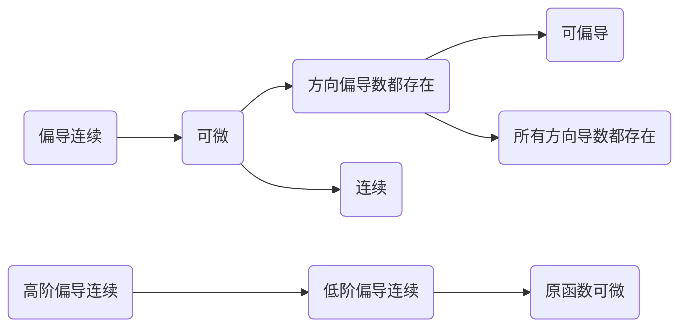

<!-- placeholder -->
<!-- more -->
# 多元函数微分学

## 多元函数极限

### 判别方法

多元函数的极限考虑一组自变量同时趋近一组常量，体现在二元函数上，是一个**二重极限**

- 任何**方式**趋近时极限都存在且相同，例如直线$(y=kx)$、曲线方式$(y=x^2、y=\sin x...)$
- 由**具有不同变量的初等函数的四则运算**复合而成的二元函数在定义域上连续，若在该点连续，则在该点极限等于函数值
- $\delta-\varepsilon$语言定义：
  - 对任意$\varepsilon>0$，存在$\var>0$，当$\begin{cases}|x-x_0|<\delta\\|y-y_0|<\delta\end{cases}$且$(x,y)\ne(x_0,y_0)$时(去心邻域内)，有$|f(x,y)-A|<\varepsilon$，则极限为$A$
  - 这种语言通常通过**放缩**来证明二重极限存在，即找到**$g(\delta)$，使其满足$f(x,y)-A<g(\delta)$**，令$\varepsilon=g(\delta)$即可

### 常见二重极限

- $\begin{align}&\lim_{(x,y)\rightarrow(0,0)}\frac{xy}{\sqrt{x^2+y^2}}=0\end{align}$，幂次方、分子继续乘$x、y$的极限都为$0$
- $\begin{align}&\lim_{(x,y)\rightarrow(0,0)}\frac{xy}{x^2+y^2}\end{align}$不存在
- $\begin{align}&\lim_{(x,y)\rightarrow(0,0)}\frac{xy}{x+y}\end{align}$不存在

### 二元函数连续性

- 若$\begin{align}&\lim_{(x,y)\rightarrow(x_0,y_0)}f(x,y)=f(x_0,y_0)\end{align}$，称在该点连续
- 当二重极限不存在、或在该点无定义、或二重极限存在但与该点定义不等时，该点为间断点
- $f(x,y)$在$(x_0,y_0)$处连续$\begin{align}\Leftrightarrow\lim_{(x,y)\rightarrow(0,0)}\Delta z=0\end{align}$
- 多元连续函数符合有界性、介值定理

## 多元函数全微分

### 求偏导

- 将其它变量视为常量，将整个函数看作一元函数求导
- 与一元函数求导一样，导数间断点但用定义、导数连续点用求导法则
- 求某点的偏导，可先行代入其它变量的值
- 偏导函数的变量结构可化为与原函数一致，但实际求出一阶偏导后，往往会多出几种变量
- 含**二阶连续偏导**的二元函数的**二阶混合偏导相等**

### 求全微分

- $\begin{align}&\Delta z=f(x+\Delta x,y+\Delta y)-f(x,y)&(1).\end{align}$
- 如果函数在$(x_0,y_0)$处可微，则$\Delta z=dz+o(\rho)$，且$\begin{align}&dz=f_x'dx+f_y'dy&(2).全微分公式\end{align}$
- 换句话说，要证明函数在该点可微，就是证明$\Delta z-dz$是$\rho$的高阶无穷小：$\begin{align}&\lim_{(x,y)\rightarrow(0,0)}\frac{o(\rho)}{\rho}=0,其中o(\rho)=(1)-(2)\\&=f(x_0+x,y_0+y)-f(x_0,y_0)-f_x'(x_0,y_0)x-f_y'(x_0,y_0)y\\&\rho=\sqrt{x^2+y^2}\end{align}$
- 全微分的四则运算法则与一元函数相同
- 若已知全增量，容易得到偏导是否存在

### 复合函数全微分

- 假设对$x$求偏导，若所有外层函数在此点可微，最内层函数对$x$可偏导(或可导)，则符合：
  - 找到所有含$x$的路径
  - 分叉路用偏导符号，单路用微分符号
  - $\begin{align}&\frac{\part f}{\part x}=\frac{\part f}{\part u}·\frac{\part u}{\part x}+\cdots\end{align}$，即相同路径求导相乘，不同路径导数相加
  - 若符号重复，可改写为$f(x,y,z)$的形式，并用下标$1,2,\cdots$指代偏导
- 一阶全微分形式不变性：复合函数一阶全微分仍可套用全微分公式

### 隐函数存在定理

- 对$n$元函数方程确定的$n-1$元隐函数，若在点$P_0$处具有**连续偏导**、函数值为$0$、对变量$z$**偏导不为$0$**，则有唯一确定的隐函数$z=f(其它n-1个变量)$
- 该隐函数的偏导$\begin{align}\frac{\part z}{\part i}=-\frac{f_i}{f_z}\end{align}$
- 由方程组确定的隐函数：将方程转换为隐函数的全微分后，联立消去某变量

### 方向导数

- 定义：$\begin{align}\frac{\part f}{\part l}=\lim_{\rho\rightarrow0}\frac{f(x+\Delta x,y+\Delta y)-f(x,y)}\rho=\lim_{t\rightarrow0^+}\frac{f(x+t\cos\alpha,y+t\cos\beta)-f(x,y)}t\end{align}$
- 方向导数是沿某一**射线**方向切片上的导数，实质上是**单侧极限**
- 若在一点可微，则(以二元函数为例)：
  - 在该点各个方向的方向导数存在，且满足：$\begin{align}\frac{\part f}{\part l}=f_x(x,y)\cos\alpha+f_y(x,y)\cos\beta\end{align}$
  - 向量$\Big(f_x(x,y),f_y(x,y)\Big)$称为**梯度**，记为$\grad f(x,y)$
  - 方向导数最大值为$\bigg|\Big(f_x(x,y),f_y(x,y)\Big)\bigg|$，即梯度方向的方向导数
  - 一个点的梯度方向，就是等值线在该点的**法线方向**

### 条件关系图

可偏导与连续无蕴涵关系，都是可微的必要条件

方向偏导数指在某一**直线**方向切片上的偏导数存在

### 空间几何

- 对**空间曲面**来说，由该曲面方程形成的三元函数的**三个偏导所构成的向量**$\vec n$就是在该点处，切平面的法向量，也即法线的方向向量
- 对以完整的参数方程形式给出的**空间曲线**来说，即$\begin{cases}x=\varphi(t)\\y=\psi(t)\\z=\omega(t)\end{cases}$，其中$\varphi(t),\psi(t),\omega(t)$导数存在且不全为$0$，则切线的方向向量就是它们**对$t$的导数**组成的向量，也即该点法平面的法向量
- 对不完整的参数方程，例如$\begin{cases}y=\varphi(x)\\z=\omega(x)\end{cases}$，则可改写为完整的参数方程$\begin{cases}x=x\\y=\varphi(x)\\z=\omega(x)\end{cases}$，此时方向向量为$(1,y',z')$
- 对**一般式空间曲线**，由隐函数存在定理，可转化为上述情况，法平面方程由此可转化为行列式$\left|\begin{matrix}x-x_0&y-y_0&z-z_0\\F_x&F_y&F_z\\G_x&G_y&G_z\end{matrix}\right|=0$，此时法向量(即切线方向向量)为$\begin{align}\left(\frac{\part(F,G)}{\part(y,z)},{\bf -}\frac{\part(F,G)}{\part(x,z)},\frac{\part(F,G)}{\part(x,y)}\right)\end{align}$，也就是**两曲面法向量的叉乘积**

### 无条件极值

- 二元函数的**二阶连续偏导**点为**极值点**的充分条件：一阶偏导为$0$，海森阵行列式大于$0$
  - 二元函数海森阵：$\left[\begin{matrix}F_{xx}&F_{xy}\\F_{yx}&F_{yy}\end{matrix}\right]$，由于二阶偏导连续时，$F_{xy}=F_{yx}$，故此时不存在$F_{xx}=0$而行列式大于$0$的情况
  - 若行列式大于$0$，则**是极值点**，且$\begin{cases}F_{xx}>0,&极小值点\\F_{xx}<0,&极大值点\end{cases}$
  - 若行列式小于$0$，则不是极值点，而是**鞍点**
  - 若行列式等于$0$，则都有可能，无法判断
- 多元函数$F(x,y,\cdots,z)$的二阶连续偏导点为极值点：一阶偏导为$0$，考虑海森阵行列式：
  - 海森阵$\left[\begin{matrix}F_{xx}&F_{xy}&\cdots&F_{xz}\\F_{yx}&F_{yy}&\cdots&F_{yz}\\\vdots&\vdots&&\vdots\\F_{zx}&F_{zy}&\cdots&F_{zz}\end{matrix}\right]$
  - 若为正定矩阵(**特征值**都大于$0$，或**顺序主子式**都大于$0$)：为极小值点
  - 若为负定矩阵(特征值都小于$0$，或$\begin{cases}奇数阶顺序主子式小于0\\偶数阶顺序主子式大于0\end{cases}$)：为极大值点
  - 若为不定矩阵(特征值含大于、小于$0$)：不是极值点
  - 若为半正定矩阵、半负定矩阵(特征值$\ge0$、$\le 0$)：无法判断
- 二元函数的不可导点也可能是极值点，但没有系统的方法可求解，只能根据图形判断

### 条件极值

在求多元函数某闭区域内的最值时，需要求出所有可疑的内部极值点及边界上的极值点，求边界极值时往往会附带条件，采用**拉格朗日乘数法**解决：

- 求$f(x,y,\cdots,z)$在$\varphi(x,y,\cdots,z)=0、\cdots、\psi(x,y,\cdots,z)=0$条件约束下的极值
- 构造函数$F(x,y,\cdots,z,\lambda,\cdots,u)=f+\lambda\varphi+\cdots+u\psi$
- 令$F$的所有偏导等于$0$，解方程组得到条件极值点$(x_0,y_0,\cdots,z_0)$及对应的$\lambda、\cdots、u$

## 练习

### 简单判断

$\begin{align}&1.讨论f(x,y)=\begin{cases}(x^2+y^2)\ln(x^2+y^2),&x^2+y^2\ne0\\0,&x^2+y^2=0\end{cases}在(0,0)处的连续性\\&解:\lim_{(x,y)\rightarrow(0,0)}f(x,y)\xlongequal[y=\rho\cos t]{x=\rho \sin t}\lim_{\rho\rightarrow0}\rho^2\ln\rho^2=\lim_{\rho\rightarrow0}\frac{\ln\rho^2}{\frac1{\rho^2}}=0=f(0,0)\end{align}$

---

$\begin{align}&2.讨论\lim_{(x,y)\rightarrow(0,0)}\frac{xy}{x+y}是否存在.\\&沿y=kx,原极限=0;沿y=x^2-x,原极限=-1,故不存在\end{align}$

---

$\begin{align}&3.讨论\lim_{(x,y)\rightarrow(0,0)}\frac{xy^2\sin ky}{x^2+y^4}是否存在(k\ne0).\\&0\le \left|\frac{xy^2\sin ky}{x^2+y^4}\right|\le\left|\frac{kxy^3}{x^2+y^4}\right|\le\left|\frac{\frac12(x^2+y^4)}{x^2+y^4}ky\right|=\frac12|ky|=0\end{align}$

---

$\begin{align}&4.f(x,y)=\begin{cases}\frac1{xy}\sin x^2y,&xy\ne0\\0,&xy=0\end{cases},则f_x'(0,1)的值为?\\&分段点,定义求导f_x'(0,1)=\lim_{x\rightarrow0}\frac{\frac1x\sin x^2}{x-0}=1\end{align}$

---

$\begin{align}&5.f(x,y)=e^{\sqrt{x^2+y^4}}在(0,0)处的偏导.\\&在看不出是否分段时,用定义求导一定正确\\&f_x(0,0)=\lim_{x\rightarrow0}\frac{e^{\sqrt{x^2}}-1}{x-0}=\lim_{x\rightarrow0}\frac{|x|}x,不存在\\&f_y(0,0)=\lim_{y\rightarrow0}\frac{e^{y^2}-1}{y-0}=\lim_{y\rightarrow0}y=0\end{align}$

---

$\begin{align}&6.证明f(x,y)在(0,0)处可微的一个充分条件为\lim_{(x,y)\rightarrow(0,0)}\frac{f(x,y)-f(0,0)}{\sqrt{x^2+y^2}}=0\\&证:由条件得\lim_{x\rightarrow0}\frac{f(x,0)-f(0,0)}{|x|}=0,两边极限都等于0,故f_x(0,0)=0\\&同理f_y(0,0)=0,\\&考虑\lim_{(x,y)\rightarrow(0,0)}\frac{\Delta f-f_x(0,0)x-f_y(0,0)y}{\sqrt{x^2+y^2}}=\lim_{(x,y)\rightarrow(0,0)}\frac{f(x,y)-f(0,0)}{\sqrt{x^2+y^2}}=0\\&故\Delta f(0,0)=f_x(0,0)dx+f_y(0,0)dy+o(\sqrt{x^2+y^2}),故可微\end{align}$

---

$\begin{align}&7.证明f(x,y)在(0,0)处可微的一个充分条件为\lim_{(x,y)\rightarrow(0,0)}\frac{f(x,y)-f(0,0)+2x-y}{\sqrt{x^2+y^2}}=0\\&与前者不同在于求偏导的过程.\\&f_x(0,0)=\lim_{x\rightarrow0}(\frac{f(x,0)-f(0,0)+2x}{|x|}·\frac{|x|}{x}-2)=-2\\&同理f_y(0,0)=1,其余过程相同\end{align}$

---

$\begin{align}&8.xy-z\ln y+e^{xz}=1在(0,1,1)的一个邻域内可确定哪几个隐函数?\\&代入F(0,1,1)=0,看偏导\\&求导:F_x=y+e^{xz}z;F_y=x-\frac zy;F_z=-\ln y+e^{xz}x\\&代入F_x(0,1,1)=2;F_y(0,1,1)=-1;F_z(0,1,1)=0\\&故可确定唯一的x(y,z)和y(x,z)\end{align}$

---

$\begin{align}&9.求函数z=1-\left(\frac{x^2}{a^2}+\frac{y^2}{b^2}\right)在点\left(\frac a{\sqrt2},\frac b{\sqrt2}\right)处\\&沿曲线\frac{x^2}{a^2}+\frac{y^2}{b^2}=1在这点的内法线方向的方向导数.\\&解:该曲线可确定唯一的y=y(x),补充x=x,即为参数方程\\&故切向量为\left(1,-\frac{f_x}{f_y}\Bigg|_{\left(\frac a{\sqrt2},\frac b{\sqrt2}\right)}\right)=(1,-\frac ba)\\&两个相反方向的法向量为\pm(b,a),内法线方向为(-b,-a)\\&故方向导数为z_x\cos\alpha+z_y\cos\beta=\frac{\sqrt{2(a^2+b^2)}}{ab}\end{align}$

---

$\begin{align}&10.若f(x,y)在有界闭区域内有二阶连续偏导,且\frac{\part^2f}{\part x\part y}\ne0,\frac{\part^2f}{\part x^2}+\frac{\part^2f}{\part y^2}=0,求其最大、最小值的位置\\&令A=\frac{\part^2f}{\part x^2},B=\frac{\part^2f}{\part x\part y},C=\frac{\part^2f}{\part y^2},易得AC-B^2<0,内部没有极值点\\&故最大、最小值只能在边界上\end{align}$

---

$\begin{align}&11.设函数f(x,y)在(0,0)处连续,且\lim_{(x,y)\rightarrow(0,0)}\frac{f(x,y)}{1-\cos{\sqrt{x^2+y^2}}}=-2,则在该点是否为极值?\\&由1-\cos\sqrt{x^2+y^2}\sim\frac{x^2+y^2}2,易得f(x,y)是-(x^2+y^2)的等价无穷小\\&即\lim_{(x,y)\rightarrow(0,0)}f(x,y)=0,连续\Rightarrow f(0,0)=0\\&f_x(0,0)=\lim_{x\rightarrow0}\frac{f(x,0)-0}x=0,同理f_y(0,0)=0,是可疑极值点\\&f(x,y)=-(x^2+y^2)(1+\alpha),其中\lim_{(x,y)\rightarrow(0,0)}\alpha=0,故f(x,y)在邻域内<0\\&故是极值点,且为极大值点\end{align}$

---

$\begin{align}&12.设f(x,y)在(0,0)某邻域内连续,且\lim_{(x,y)\rightarrow(0,0)}\frac{f(x,y)-xy}{(x^2+y^2)^2}=1,证明(0,0)不是f的极值点\\&由x^2+y^2\rightarrow0,得f(x,y)-xy\rightarrow0,得\lim_{(x,y)\rightarrow(0,0)}f(x,y)=0,由连续得f(0,0)=0\\&[举特例说明]:再由条件得\lim_{x\rightarrow0}\frac{f(x,0)-0}{x^4}=1,即在y=0路径上为极小值点\\&在y=-x路径上,\lim_{x\rightarrow0}\frac{f(x,-x)+x^2}{4x^4}=1,\therefore0>\lim_{x\rightarrow0}f(x,-x)>-x^2,是极大值点\\&故不是极值点\\&[不通过路径说明]:\frac{f(x,y)}{xy+(x^2+y^2)^2}=1+\alpha,其中\lim_{(x,y)\rightarrow(0,0)}\alpha=0\\&即f(x,y)=xy+(1+\alpha)(x^2+y^2)^2\\&故f(x,y)符号取决于xy,当x、y异号时为极大值点,当x、y同号时为极小值点\end{align}$

### 大题练习

$\begin{align}&1.通过\begin{cases}x=e^u\\y=e^v\end{cases},变换2x^2\frac{\part^2z}{\part x^2}+xy\frac{\part^2z}{\part x\part y}+y^2\frac{\part^2z}{\part y^2}=0\\&\frac{\part z}{\part u}=\frac{\part z}{\part x}e^u;\ \ \frac{\part z}{\part v}=\frac{\part z}{\part y}e^v\\&\frac{\part^2z}{\part u^2}=e^u\left(\frac{\part z}{\part x}+\frac{\part^2z}{\part x^2}e^u\right),对v二阶偏导、混合偏导同理\\&最终答案:2\frac{\part^2z}{\part u^2}+\frac{\part^2z}{\part u\part v}+\frac{\part^2z}{\part v^2}-2\frac{\part z}{\part u}-\frac{\part z}{\part v}=0\end{align}$

---

$\begin{align}&2.讨论f(x,y)=\begin{cases}\large\frac{x^2y^2}{(x^2+y^2)^{\frac32}},&x^2+y^2\ne0\\0,&x^2+y^2=0\end{cases}在(0,0)处是否连续、偏导数存在性、以及是否可微\\&1).0\le\lim_{(x,y)\rightarrow(0,0)}f(x,y)\le\lim_{(x,y)\rightarrow(0,0)}\frac{x^2y^2}{x^2+y^2}=0,故连续\\&2).分段函数用定义,f_x(0,0)=\lim_{x\rightarrow0}\frac{f(x,0)-f(0,0)}{x-0}=\lim_{x\rightarrow0}\frac{x}{x^3}·0=0\\&f_y(0,0)=\lim_{y\rightarrow0}\frac{f(0,y)-f(0,0)}{y-0}=0,偏导存在\\&3).\lim_{(x,y)\rightarrow(0,0)}\frac{\frac{x^2y^2}{(x^2+y^2)^{\frac32}}-0-0x-0y}{\rho}=\lim_{(x,y)\rightarrow(0,0)}\frac{x^2y^2}{(x^2+y^2)^2}=\lim_{(x,y)\rightarrow(0,0)}\left(\frac{xy}{x^2+y^2}\right)^2不存在,\\&故不可微\end{align}$
