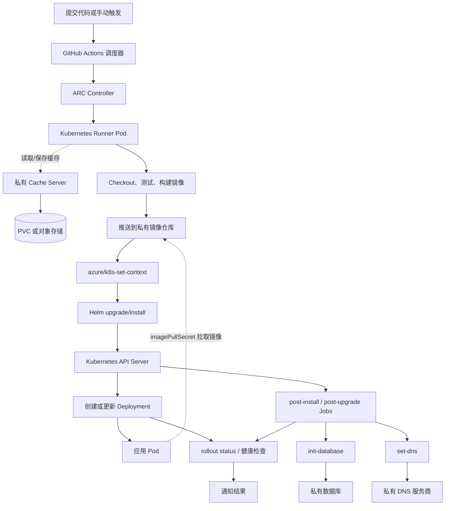
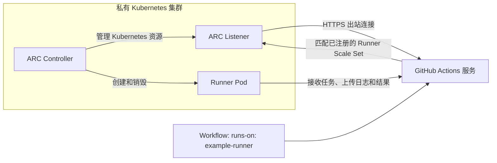

<!-- placeholder -->
<!-- more -->

# `GitHub Actions`与`GitHub Workflows`

## `GitHub Actions`、`Workflow`与`CI/CD`

- `GitHub Actions`是`GitHub`提供的自动化平台，可以在代码仓库中自动执行测试、构建、发布和部署等任务
- `CI`（`Continuous Integration`，持续集成）主要解决“代码提交后自动检查”的问题，例如安装依赖、代码检查、单元测试和构建
- `CD`通常有两种含义：持续交付（`Continuous Delivery`）和持续部署（`Continuous Deployment`）
  - 持续交付：自动生成可以发布的产物，但生产环境部署通常还需要人工批准
  - 持续部署：验证通过后自动部署到目标环境
- `Workflow`是保存在仓库中的一份自动化流程定义，使用`YAML`编写，文件必须放在`.github/workflows/`目录下
- `Action`是一个可复用的步骤，例如`actions/checkout`用于检出代码、`actions/setup-node`用于安装`Node.js`
- `Runner`是实际执行任务的机器，可以使用`GitHub-hosted runner`，也可以配置自己的`self-hosted runner`

官方文档入口：[GitHub Actions官方文档](https://docs.github.com/en/actions)。

一条常见的流水线可以抽象成下面的关系：

```text
事件（push / pull_request）
          ↓
Workflow（完整流程）
          ↓
Jobs（相互独立的任务，默认并行）
          ↓
Steps（任务中的步骤，按顺序执行）
          ↓
Runner（执行命令的机器）
```

例如，开发者向`main`分支提交代码后，工作流可以自动完成：

```text
检出代码 → 安装运行环境 → 安装依赖 → 检查与测试 → 构建产物 → 部署
```

## `Workflow`示例

新建`.github/workflows/ci.yml`：

```yaml
name: Node CI

on:
  push:
    branches: [main, develop]
  pull_request:
    branches: [main]
  workflow_dispatch:

permissions:
  contents: read

jobs:
  test:
    name: Test on Node.js ${{ matrix.node-version }}
    runs-on: ubuntu-latest
    strategy:
      matrix:
        node-version: ["18", "20", "22"]

    steps:
      - name: Checkout
        uses: actions/checkout@v4

      - name: Setup Node.js
        uses: actions/setup-node@v4
        with:
          node-version: ${{ matrix.node-version }}
          cache: npm

      - name: Install dependencies
        run: npm ci

      - name: Lint
        run: npm run lint --if-present

      - name: Test
        run: npm test
```

将这个文件提交到仓库后：

- `push`事件会在推送到`main`或`develop`时触发
- `pull_request`事件会在针对`main`创建或更新`Pull Request`时触发
- `workflow_dispatch`允许在`Actions`页面手动运行工作流
- `matrix`会为三个`Node.js`版本分别创建一个任务
- 同一个`job`中的`steps`按顺序执行；不同的矩阵任务默认并行执行

示例中的`actions/checkout@v4`和`actions/setup-node@v4`是可复用的现成`Action`。版本标签会随着维护者发布新版本而变化，生产流水线可以进一步将`uses`固定到经过审查的提交`SHA`，避免标签被移动后执行到未经预期的代码。

## `Workflow`文件的基本语法

- `Workflow`级配置：决定工作流的名称、权限、变量和并发行为
  - **`name`**：工作流在`Actions`页面显示的名称
  - `run-name`：某次运行的动态名称，可以使用表达式
  - **`permissions`**：`GITHUB_TOKEN`可以访问的权限
  - **`env`**：工作流、任务或步骤使用的环境变量
  - `defaults`：默认的`run`配置，例如默认工作目录和`shell`
  - **`concurrency`**：控制同一组运行是否排队或取消

- **`on`**：触发事件
  - **`push`**：推送提交时触发，可以用`branches`、`tags`和`paths`过滤分支、标签和文件路径
  - **`pull_request`**：`Pull Request`打开、更新或重新打开时触发，常用于代码检查
  - **`workflow_dispatch`**：手动触发；多数部署 Workflow 不声明输入参数
  - `schedule`：按`cron`表达式定时触发，时间使用`UTC`
  - `workflow_run`：另一个工作流运行结束后触发，适合拆分构建和部署
  - `workflow_call`：把当前文件作为可复用工作流供其他工作流调用
  - `on`可以写成一个事件名、事件数组，或者带过滤条件的映射：

    ```yaml
    # 任意 push 都触发
    on: push

    # 多个事件都触发
    on: [push, pull_request]

    # 带过滤条件
    on:
      push:
        branches:
          - main
        paths:
          - 'src/**'
          - 'package.json'
      pull_request:
        types: [opened, synchronize, reopened]
    ```

  - `pull_request`的目标分支过滤写在`branches`中；它与提交者推送代码的源分支不是同一个概念。对于来自外部贡献者的`Pull Request`，不要为了读取密钥而随意改用`pull_request_target`，否则不可信代码可能获得仓库权限。

- **`jobs`**：任务
  - **`runs-on`**：选择执行环境，例如`ubuntu-latest`、`windows-latest`、`macos-latest`
  - **`needs`**：声明依赖的任务；没有依赖关系的任务默认并行
  - **`if`**：根据表达式决定是否运行任务
  - **`strategy.matrix`**：为多个系统、语言版本或配置生成任务组合
  - **`permissions`**：在任务级别覆盖令牌权限
  - **`environment`**：关联`staging`或`production`等环境，可以使用环境保护规则和环境密钥
  - **`outputs`**：把任务中的步骤输出传给后续任务
  - `timeout-minutes`：限制任务最长运行时间
  - `continue-on-error`：允许任务失败后继续，但应谨慎使用，否则容易隐藏真正的问题
  - `container`和`services`：分别为任务指定容器或启动数据库等服务容器
  - `jobs`下的每个键都是一个任务`ID`，任务至少要指定`runs-on`和`steps`：

    ```yaml
    jobs:
      build:
        runs-on: ubuntu-latest
        steps:
          - run: npm run build

      deploy:
        needs: build
        runs-on: ubuntu-latest
        steps:
          - run: ./deploy.sh
    ```

  - `needs`既可以保证顺序，也可以读取前置任务的输出：

    ```yaml
    jobs:
      build:
        runs-on: ubuntu-latest
        outputs:
          artifact-version: ${{ steps.version.outputs.value }}
        steps:
          - id: version
            run: echo "value=build-${GITHUB_SHA::7}" >> "$GITHUB_OUTPUT"

      deploy:
        needs: build
        runs-on: ubuntu-latest
        steps:
          - run: echo "Deploy ${{ needs.build.outputs.artifact-version }}"
    ```

  - 如果多个任务都依赖`build`，它们在`build`完成后可以并行；只有明确写出`needs`，才会形成串行关系。

- **`steps`**：步骤
  - **`name`**：步骤在任务日志中的显示名称
  - **`uses`**：调用一个可复用的`Action`
  - **`run`**：在`Runner`中执行命令
  - **`with`**：向`Action`传入输入参数
  - **`env`**：为步骤设置环境变量
  - **`id`**：给步骤命名，之后可以通过`steps.<id>.outputs.<name>`读取输出
  - **`if`**：按条件跳过步骤
  - `working-directory`：指定命令执行目录
  - `shell`：指定命令解释器，例如`bash`或`pwsh`
  - `timeout-minutes`：限制步骤运行时间
  - `continue-on-error`：允许当前步骤失败后继续
  - 一个步骤通常使用`run`或`uses`二选一：

    ```yaml
    steps:
      - name: Run a shell command
        run: echo "hello"

      - name: Run multiple commands
        run: |
          npm ci
          npm test

      - name: Use an Action
        uses: actions/checkout@v4

      - name: Pass inputs to an Action
        uses: actions/setup-node@v4
        with:
          node-version: "20"

      - name: Set environment variables
        env:
          NODE_ENV: test
        run: npm test
    ```

  - `run`会在`Runner`的操作系统上执行命令，默认情况下同一个任务中的步骤共享工作目录。`uses`调用一个已经封装好的`Action`，`with`是传给该`Action`的输入参数。

### 常用通用 `Action`

下面这些`Action`不依赖具体业务，通常可以组合出大多数项目的`CI`流程。示例中的版本号沿用本文其他示例，实际使用时应根据对应`Action`的维护状态更新版本，并在重要流水线中考虑固定到提交`SHA`。

- `actions/checkout@v4`：将仓库代码检出到`Runner`的工作目录
  - **`ref`**：指定要检出的分支、标签或提交
  - **`fetch-depth`**：指定检出的提交历史深度，设置为`0`表示检出完整历史
  - **`submodules`**：设置为`true`或`recursive`以检出`Git submodule`
- `actions/setup-node@v4`：安装并配置`Node.js`
  - **`node-version`**：指定`Node.js`版本
  - **`cache`**：启用包管理器缓存，可设置为`npm`、`yarn`或`pnpm`
  - **`registry-url`**：配置`npm`注册表地址
- `actions/setup-python@v5`：安装并配置`Python`
  - **`python-version`**：指定`Python`版本
  - **`cache`**：缓存包管理器依赖，常用值为`pip`
- `actions/setup-java@v4`：安装并配置`JDK`
  - **`distribution`**：指定`JDK`发行版，例如`temurin`
  - **`java-version`**：指定`Java`版本
  - **`cache`**：缓存`Maven`或`Gradle`依赖
- `actions/cache@v4`：缓存依赖目录或中间构建结果，减少重复下载和计算
  - **`path`**：需要缓存的文件或目录
  - **`key`**：当前缓存的唯一键，通常包含操作系统和锁文件哈希
  - **`restore-keys`**：精确键未命中时使用的备用键前缀
  - 缓存只负责复用文件，不能代替`npm ci`、`pip install`等安装命令
- `actions/upload-artifact@v4`：保存本次运行生成的构建结果、测试报告等产物
  - **`name`**：产物名称
  - **`path`**：需要上传的文件或目录
  - **`retention-days`**：产物保留天数
- `actions/download-artifact@v4`：在后续任务中下载构建任务上传的产物
  - **`name`**：要下载的产物名称
  - **`path`**：产物下载目录
  - `upload-artifact`和`download-artifact`通常成对使用；它们适合在不同`job`之间传递构建结果，不能与依赖缓存混用
- `docker/login-action@v3`：登录容器镜像仓库
  - **`registry`**：镜像仓库地址，例如`ghcr.io`
  - **`username`**和**`password`**：登录凭据，敏感值应通过`Secrets`传入
- `docker/build-push-action@v6`：构建并可选地推送`Docker`镜像
  - **`context`**：镜像构建上下文目录
  - **`file`**：`Dockerfile`路径
  - **`push`**：是否推送构建结果
  - **`tags`**：镜像标签
  - **`platforms`**：需要构建的目标平台
- `azure/k8s-set-context@v4`：使用 kubeconfig 设置当前任务的 Kubernetes 上下文，后续的`kubectl`和`helm`命令都会连接到这个集群
  - **`method`**：认证方式，使用 kubeconfig 时填写`kubeconfig`
  - **`kubeconfig`**：kubeconfig 内容，通常通过`Secrets`传入
  - **`context`**：kubeconfig 中要使用的集群上下文

  ```yaml
  - uses: azure/k8s-set-context@v4
    with:
      method: kubeconfig
      kubeconfig: ${{ secrets.KUBECONFIG }}
      context: example-cluster
  - run: helm upgrade --install example-app ./charts/example-app
  ```

## 自定义 actions

自定义 Action 用于把重复步骤封装成一个可复用单元。下面以 `composite` Action 为例，示例不依赖具体仓库或业务。

- 目录：在 `.github/actions/<name>/action.yml` 或 `action.yaml` 中定义，Workflow 通过相对路径调用。

  ```text
  .github/
  └── actions/
      └── setup-node/
          └── action.yml
  ```

- **`name`**：Action 的显示名称
- **`description`**：Action 的用途说明
- **`inputs`**：调用方可以传入的参数；composite Action 接收到的输入按字符串处理，布尔开关通常比较 `'true'` 或 `'false'`
- **`runs`**：指定 Action 的实现方式；`composite` 用于组合 Shell 命令和其他 Action，`node20` 用于 JavaScript Action，`docker` 用于 Docker container Action

  ```yaml
  name: Setup Node.js if needed
  description: Set up Node.js only when it is not installed
  inputs:
    node-version:
      description: Node.js version
      required: false
      default: "22"
    install-yarn:
      description: Install Yarn with Corepack
      required: false
      default: "false"
    version-file-path:
      description: Directory containing the package manager files
      required: false
      default: ${{ github.workspace }}
  runs:
    using: composite
    steps:
      - id: nodejs-installed
        shell: bash -exo pipefail {0}
        run: |
          if command -v node >/dev/null 2>&1; then
            echo "version=$(node -v)" >> "$GITHUB_OUTPUT"
          fi
      - if: ${{ steps.nodejs-installed.outputs.version == '' }}
        uses: actions/setup-node@v4
        with:
          node-version: ${{ inputs.node-version }}
      - if: ${{ inputs.install-yarn == 'true' }}
        shell: bash -exo pipefail {0}
        run: |
          cd ${{ inputs.version-file-path }}
          corepack enable
          corepack install
  ```

- **`shell`**：composite Action 中的 `run` 步骤显式设置 Shell，否则元数据文件校验会失败。

  ```yaml
  steps:
    - uses: ./.github/actions/setup-node
      with:
        node-version: "22"
        install-yarn: "true"
        version-file-path: ${{ github.workspace }}/example-site
  ```

- `gh workflow run`：自定义 Action 可以把另一个 Workflow 当作子流程调用，并用 `-F` 传入它的 `workflow_dispatch.inputs`。

  ```bash
  gh auth login --with-token <<< "$GITHUB_TOKEN"
  gh workflow run domain-transfer.yaml \
    -F domain="$ROOT_DOMAIN" \
    -F nameservers="$NAMESERVERS" \
    -F create-zone=false
  ```

- `build-images`：先记录 Runner 是否已有 Java；没有时才安装，再根据 `push` 输入决定只构建还是发布镜像。

  ```yaml
  inputs:
    push:
      required: false
      default: "false"
    project:
      required: true
  runs:
    using: composite
    steps:
      - id: installed-java
        shell: bash
        run: |
          if command -v java &> /dev/null; then
            echo "version=$(java -version 2>&1 | head -n 1 | awk -F '"' '{print $2}')" >> "$GITHUB_OUTPUT"
          fi
      - if: ${{ steps.installed-java.outputs.version == '' }}
        uses: actions/setup-java@v4
        with:
          distribution: temurin
          java-version: "21"
      - if: ${{ inputs.push != 'true' }}
        shell: bash
        run: ./gradlew :${{ inputs.project }}:bootBuildImage -x spotlessCheck
      - if: ${{ inputs.push == 'true' }}
        shell: bash
        run: ./gradlew :${{ inputs.project }}:bootBuildImage --publishImage --parallel -x spotlessCheck
  ```

- `setup-node-if-needed`：把“检查命令是否存在、按需安装、配置缓存”封装成一个步骤。

  ```yaml
  - id: nodejs-installed
    shell: bash -exo pipefail {0}
    run: |
      if command -v node >/dev/null 2>&1; then
        echo "version=$(node -v)" >> "$GITHUB_OUTPUT"
      fi
  - if: steps.nodejs-installed.outputs.version == ''
    uses: actions/setup-node@v4
    with:
      node-version: ${{ inputs.node-version }}
  - if: inputs.install-yarn == 'true'
    shell: bash -exo pipefail {0}
    run: |
      cd ${{ inputs.version-file-path }}
      corepack enable
      corepack install
  - if: steps.nodejs-installed.outputs.version == ''
    uses: actions/setup-node@v4
    with:
      cache: ${{ inputs.install-yarn == 'true' && 'yarn' || 'npm' }}
  ```

- `deploy-job`：把完整镜像名拆成 registry、repository 和 tag，再把多行 `key=value` 转换成多个 Helm `--set` 参数。

  ```bash
  FULL_IMAGE="${{ inputs.image }}"
  EXTRA_SET_ARGS="${{ inputs.extra-set-args }}"

  REGISTRY="${FULL_IMAGE%%/*}"
  REST="${FULL_IMAGE#*/}"
  REPO="${REST%:*}"
  TAG="${REST##*:}"

  HELM_EXTRA=()
  while IFS= read -r line; do
    [[ -z "$line" ]] && continue
    key="${line%%=*}"
    val="${line#*=}"
    HELM_EXTRA+=(--set "${key}=${val//,/\\,}")
  done <<< "$EXTRA_SET_ARGS"

  helm upgrade --install "$RELEASE_NAME" ./charts/example-job \
    --namespace "$NAMESPACE" \
    --values "$VALUES_FILE" \
    --set "image.registry.url=${REGISTRY}" \
    --set "image.repository=${REPO}" \
    --set "image.tag=${TAG}" \
    "${HELM_EXTRA[@]}" \
    --wait \
    --timeout=5m \
    --atomic
  ```

## 表达式、上下文与环境变量

### 表达式语法

GitHub Actions使用`${{ }}`计算表达式：

```yaml
env:
  short-sha: ${{ github.sha }}

jobs:
  deploy:
    if: ${{ github.ref == 'refs/heads/main' }}
    runs-on: ubuntu-latest
    steps:
      - run: echo "${{ github.repository }} @ ${{ github.sha }}"
```

在`if`字段中通常可以省略`${{ }}`，但保留它更容易辨认这是工作流表达式。常用运算符和函数包括：

- 比较：`==`、`!=`、`&&`、`||`
- 字符串：`contains()`、`startsWith()`、`endsWith()`、`format()`
- 文件：`hashFiles('**/package-lock.json')`
- 状态：`success()`、`failure()`、`cancelled()`、`always()`
- 转换：`fromJSON()`、`toJSON()`

例如只允许`main`分支部署，并在失败时执行清理：

```yaml
jobs:
  deploy:
    if: github.event_name == 'push' && github.ref == 'refs/heads/main'
    runs-on: ubuntu-latest
    steps:
      - name: Deploy
        run: ./deploy.sh
      - name: Collect logs
        if: ${{ failure() || cancelled() }}
        run: ./collect-logs.sh
```

### 常用上下文

上下文是由`GitHub Actions`提供的只读数据：

| 上下文    | 常见用途                                         |
| --------- | ------------------------------------------------ |
| `github`  | 仓库、分支、提交、事件和触发者，例如`github.ref` |
| `env`     | 当前工作流、任务或步骤定义的环境变量             |
| `vars`    | 仓库、组织或环境级别的非敏感配置变量             |
| `secrets` | 仓库、组织或环境级别的敏感信息                   |
| `runner`  | 执行机器的信息，例如操作系统和临时目录           |
| `matrix`  | 当前矩阵任务的参数                               |
| `steps`   | 当前任务中带有`id`的步骤输出                     |
| `needs`   | 前置任务的结果和任务输出                         |
| `inputs`  | 手动触发或可复用工作流的输入                     |

表达式和`run`脚本中的环境变量不是同一种语法：

```yaml
steps:
  - name: Compare syntaxes
    env:
      COMMIT_SHA: ${{ github.sha }}
    run: |
      echo "Shell variable: $COMMIT_SHA"
      echo "Expression: ${{ github.ref }}"
```

### 在步骤之间传递数据

步骤输出写入`GITHUB_OUTPUT`，环境变量写入`GITHUB_ENV`：

```yaml
steps:
  - id: version
    run: echo "value=1.2.3" >> "$GITHUB_OUTPUT"

  - name: Use step output
    run: echo "version is ${{ steps.version.outputs.value }}"

  - name: Set an environment variable
    run: echo "RELEASE_CHANNEL=stable" >> "$GITHUB_ENV"

  - name: Use the environment variable
    run: echo "$RELEASE_CHANNEL"
```

`GITHUB_OUTPUT`只适合传递步骤输出，不能把一个任务中的文件直接带到另一个任务。每个任务通常使用全新的`Runner`，跨任务传文件应该使用`Artifact`。

## `Matrix`：批量执行同一类任务

`Matrix`会把一个`job`展开成多个独立任务，每个任务都有自己的`Runner`、工作目录、日志和状态。它适合处理一批结构相同但参数不同的任务，不需要为每个模块、镜像或部署对象复制一份`job`。

- **简单值矩阵**：API 工作流把多个模块拆成并行测试任务；`needs: test`的后续任务会等待所有模块测试结束。

  ```yaml
  jobs:
    test:
      if: ${{ !needs.skip-workflow.outputs.skip }}
      needs: [skip-workflow]
      name: "test: ${{ matrix.module }}"
      runs-on: example-runner-low-docker
      strategy:
        fail-fast: true
        matrix:
          module:
            - example-bot
            - example-jobs
      steps:
        - uses: actions/checkout@v4
        - run: ./gradlew :${{ matrix.module }}:test
  ```

- **对象矩阵**：镜像构建任务把项目名和 Runner 规格放在同一行；没有指定 Runner 的项目使用默认值。

  ```yaml
  jobs:
    push-docker:
      name: "docker: ${{ matrix.project.name }}"
      runs-on: ${{ matrix.project.runner || 'example-runner-low-docker' }}
      strategy:
        fail-fast: true
        matrix:
          project:
            - name: example-api
              runner: example-runner-high
            - name: example-bot
      steps:
        - uses: actions/checkout@v4
        - uses: ./.github/actions/build-docker-images
          with:
            project: ${{ matrix.project.name }}
            push: ${{ github.event_name != 'pull_request' }}
  ```

- **动态矩阵**：部署上下文不是直接写死在 Workflow 中，而是先由脚本扫描目录生成 JSON，再用`fromJson()`把输出转换为矩阵。

  ```bash
  results="[]"
  while read -r context; do
    runner=example-runner-mini
    results=$(echo "$results" | jq ". += [{context: \"$context\", runner: \"$runner\"}]")
  done < <(ls deploy/values)

  echo "$results" | jq -c .
  ```

  ```yaml
  jobs:
    contexts-matrix:
      runs-on: example-runner
      outputs:
        contexts: ${{ steps.contexts.outputs.contexts }}
      steps:
        - uses: actions/checkout@v4
        - id: contexts
          run: |
            matrix=$(./scripts/contexts-matrix.sh)
            echo "contexts<<EOF" >> "$GITHUB_OUTPUT"
            echo "$matrix" >> "$GITHUB_OUTPUT"
            echo "EOF" >> "$GITHUB_OUTPUT"

    deploy-apps:
      needs: contexts-matrix
      strategy:
        fail-fast: false
        matrix:
          context: ${{ fromJson(needs.contexts-matrix.outputs.contexts) }}
      runs-on: ${{ matrix.context.runner }}
      steps:
        - uses: actions/checkout@v4
        - uses: azure/k8s-set-context@v4
          with:
            method: kubeconfig
            kubeconfig: ${{ secrets.KUBECONFIG }}
            context: ${{ matrix.context.context }}
  ```

  这个矩阵的每一行同时携带 Kubernetes context 和 Runner 名称，因此矩阵不仅决定部署多少次，还决定每次部署连接哪个集群、使用哪类 Runner。

- **`include`矩阵**：多个 CronJob 共用同一套部署步骤，只把名称、镜像和 values 文件作为每一行的参数。

  ```yaml
  jobs:
    deploy-jobs:
      strategy:
        fail-fast: false
        matrix:
          include:
            - name: sync-data
              image-name: example-job
            - name: refresh-cache
              image-name: example-job
      steps:
        - uses: actions/checkout@v4
        - uses: ./.github/actions/deploy-job
          with:
            release-name: example-${{ matrix.name }}
            values-file: deploy/example/${{ matrix.name }}.yaml
            image: ${{ matrix.image-name }}
  ```

- **基础设施矩阵**：基础设施工作流把产品配置和集群配置组合起来，每个矩阵任务部署一个组件。

  ```yaml
  jobs:
    deploy:
      name: "Deploy ${{ matrix.product.name }} ${{ matrix.cluster.name }}"
      runs-on: ${{ matrix.cluster.runner }}
      strategy:
        fail-fast: false
        matrix:
          product:
            - name: example-ingress
              chart: ingress
              namespace: istio-system
          cluster:
            - name: default
              runner: example-runner-mini
              context: example-cluster
      steps:
        - uses: actions/checkout@v4
        - uses: azure/k8s-set-context@v4
          with:
            method: kubeconfig
            kubeconfig: ${{ secrets.KUBECONFIG }}
            context: ${{ matrix.cluster.context }}
        - run: |
            helm upgrade --install ${{ matrix.product.name }} \
              ./charts/${{ matrix.product.chart }} \
              --namespace ${{ matrix.product.namespace }}
  ```

- **`fail-fast`**：测试和镜像构建矩阵使用`true`，一个任务失败时尽快停止同组任务；部署矩阵使用`false`，避免一个组件失败后取消其他组件的部署。

## 缓存、产物与任务依赖

### `Cache`与 `Artifact`的区别

- `Cache`用于加速重复执行，例如缓存`npm`、`pip`或`Maven`依赖；缓存失效时仍然应该能够重新安装
- `Artifact`用于保存本次运行生成的文件，例如构建目录、测试报告和安装包，并在后续任务中下载
- 不要把缓存当作可靠的发布存储，也不要把密钥或敏感文件上传为产物

使用`setup-node`缓存`npm`依赖：

```yaml
steps:
  - uses: actions/checkout@v4
  - uses: actions/setup-node@v4
    with:
      node-version: "20"
      cache: npm
  - run: npm ci
  - run: npm test
```

使用产物连接构建任务和部署任务：

```yaml
jobs:
  build:
    runs-on: ubuntu-latest
    steps:
      - uses: actions/checkout@v4
      - uses: actions/setup-node@v4
        with:
          node-version: "20"
          cache: npm
      - run: npm ci
      - run: npm run build
      - name: Upload build artifact
        uses: actions/upload-artifact@v4
        with:
          name: site
          path: dist/

  deploy:
    needs: build
    runs-on: ubuntu-latest
    steps:
      - name: Download build artifact
        uses: actions/download-artifact@v4
        with:
          name: site
          path: dist/
      - run: ./deploy.sh dist
```

部署任务不应该再次从分支检出并重新构建，而应该部署已经通过检查的构建产物。这样可以减少“测试的代码”和“实际部署的代码”不一致的可能性。

## 常见 `CI/CD` 流程

### `Pull Request` 检查

最基础的`CI`只做验证，不写入仓库，也不部署生产环境：

```yaml
name: Pull Request CI

on:
  pull_request:
    branches: [main]
  push:
    branches: [main]

permissions:
  contents: read

jobs:
  verify:
    runs-on: ubuntu-latest
    steps:
      - uses: actions/checkout@v4
      - uses: actions/setup-node@v4
        with:
          node-version: "20"
          cache: npm
      - run: npm ci
      - run: npm run lint --if-present
      - run: npm test
      - run: npm run build
```

如果`push`和`pull_request`都指向同一个提交，可能会产生两次运行。可以根据团队习惯只保留一种触发方式，或者使用`concurrency`取消同一分支上过时的运行：

```yaml
concurrency:
  group: ${{ github.workflow }}-${{ github.ref }}
  cancel-in-progress: true
```

### 构建后部署

一个典型的持续部署工作流是“构建和验证成功后才能部署”：

```yaml
name: Build and deploy

on:
  push:
    branches: [main]
  workflow_dispatch:

permissions:
  contents: read

jobs:
  build:
    runs-on: ubuntu-latest
    steps:
      - uses: actions/checkout@v4
      - uses: actions/setup-node@v4
        with:
          node-version: "20"
          cache: npm
      - run: npm ci
      - run: npm test
      - run: npm run build
      - uses: actions/upload-artifact@v4
        with:
          name: app
          path: dist/

  deploy:
    needs: build
    if: github.event_name == 'push' && github.ref == 'refs/heads/main'
    runs-on: ubuntu-latest
    environment:
      name: production
    permissions:
      contents: read
    steps:
      - uses: actions/download-artifact@v4
        with:
          name: app
          path: dist/
      - run: ./deploy.sh dist
```

`environment: production`可以配合环境保护规则配置审批人、部署分支限制和环境级别的密钥。这样，`Pull Request`仍然可以执行构建和测试，但不会因为`deploy`任务存在而自动发布。

### 发布容器镜像

发布到`GitHub Container Registry`时，通常只在`main`或发布标签上执行，并授予任务最小的`packages: write`权限：

```yaml
name: Publish image

on:
  push:
    branches: [main]
    tags: ["v*.*.*"]

permissions:
  contents: read
  packages: write

jobs:
  publish:
    runs-on: ubuntu-latest
    steps:
      - uses: actions/checkout@v4
      - uses: docker/login-action@v3
        with:
          registry: ghcr.io
          username: ${{ github.actor }}
          password: ${{ secrets.GITHUB_TOKEN }}
      - uses: docker/build-push-action@v6
        with:
          context: .
          push: true
          tags: ghcr.io/${{ github.repository }}:${{ github.sha }}
```

## tricks

### Workflow 的执行顺序

Workflow 中的任务由 `needs` 连接，文件中的先后顺序不决定执行顺序。以 API 部署流程为例：

```text
skip-workflow
├── test
├── push-docker
├── build-helper-images
├── contexts-matrix
└── spotless-check（仅 pull_request）

test + push-docker + build-helper-images + contexts-matrix
└── deploy-apps（非 pull_request）
    └── notification（非 pull_request）
```

- **`needs`**：没有依赖的任务可以并行运行；`deploy-apps` 等待测试、镜像构建和部署上下文都完成，`notification` 再等待部署完成。

  ```yaml
  jobs:
    test:
      needs: [skip-workflow]

    push-docker:
      needs: [skip-workflow]

    build-helper-images:
      needs: [skip-workflow]

    contexts-matrix:
      needs: [skip-workflow]

    deploy-apps:
      if: ${{ github.event_name != 'pull_request' && !needs.skip-workflow.outputs.skip }}
      needs:
        - skip-workflow
        - push-docker
        - build-helper-images
        - contexts-matrix
        - test

    notification:
      if: ${{ github.event_name != 'pull_request' && !needs.skip-workflow.outputs.skip }}
      needs:
        - skip-workflow
        - push-docker
        - deploy-apps
  ```

### `push` 与 `pull_request`

合理的顺序是先准备环境，再恢复缓存，然后检查代码和测试，最后构建镜像。在这个流程里，只有 `push` 才登录镜像仓库、推送镜像和部署：

```text
pull_request:
  checkout -> setup -> cache -> test/lint -> build（push=false）
  -> report

push:
  checkout -> setup -> cache -> test -> build（push=true）
  -> deploy -> notification
```

- **共同 steps**：两个事件都先检出代码、准备工具链、恢复缓存，再运行测试和静态检查。Gradle 的缓存由 `setup-gradle` 在这一步处理。

  ```yaml
  steps:
    - uses: actions/checkout@v4
    - uses: actions/setup-java@v4
      with:
        distribution: temurin
        java-version: "21"
    - uses: gradle/actions/setup-gradle@v6
    - run: ./gradlew test
  ```

- **`pull_request`**：只验证和构建，不登录私有镜像仓库，不推送镜像；下面的构建和报告步骤接在共同 steps 后。

  ```yaml
  - uses: docker/build-push-action@v5
    with:
      context: .
      push: false
  - if: failure()
    uses: actions/upload-artifact@v4
    with:
      name: test-reports
      path: "**/build/reports/tests/test/"
  ```

- **`push`**：共同 steps 成功后登录镜像仓库、构建并推送镜像；部署作为后续 job，通过 `needs` 等待构建完成。

  ```yaml
    - uses: docker/login-action@v3
      with:
        registry: ${{ secrets.DOCKER_REGISTRY }}
        username: ${{ secrets.DOCKER_USERNAME }}
        password: ${{ secrets.DOCKER_PASSWORD }}
    - uses: docker/build-push-action@v5
      with:
        context: .
        push: true

  deploy:
    if: ${{ github.event_name == 'push' }}
    needs: build-image
    steps:
      - uses: actions/checkout@v4
      - run: helm upgrade --install example-app ./charts/example-app
  ```

- **`spotless-check`**：格式检查只放在 Pull Request 分支上，不进入 push 的部署链路；步骤顺序是检出代码、准备 Java、准备 Gradle、执行格式检查。

  ```yaml
  jobs:
    spotless-check:
      if: ${{ github.event_name == 'pull_request' && !needs.skip-workflow.outputs.skip }}
      needs: [skip-workflow]
      runs-on: example-runner-mini
      steps:
        - uses: actions/checkout@v4
        - uses: actions/setup-java@v4
          with:
            distribution: temurin
            java-version: "21"
        - uses: gradle/actions/setup-gradle@v6
        - run: ./gradlew spotlessCheck
  ```

### 缓存

实际有三种缓存方式，以及一个共享缓存后端，作用不同。

缓存 Action 执行到对应步骤时先恢复缓存；如果没有命中，任务继续执行，作业结束时再保存新缓存。显式 `actions/cache` 的 key 由系统、项目和锁文件哈希组成，`restore-keys` 只用于回退到同一项目的旧缓存。

- **`gradle/actions/setup-gradle`**：缓存 Gradle User Home；`cache-read-only: false` 允许构建任务写入缓存。

  ```yaml
  - uses: gradle/actions/setup-gradle@v6
    with:
      cache-read-only: false
  - run: ./gradlew test
  ```

- **`actions/setup-node`**：通过 `cache` 缓存 npm 或 Yarn 依赖。

  ```yaml
  - uses: actions/setup-node@v4
    with:
      node-version: "22"
      cache: yarn
  - run: yarn install --immutable
  ```

- **`actions/cache`**：自己指定目录、精确键和备用键；Yarn 缓存使用锁文件哈希区分版本。

  ```yaml
  - uses: actions/cache@v4
    with:
      path: websites/example-site/.yarn/cache
      key: ${{ runner.os }}-yarn-example-site-${{ hashFiles('websites/example-site/yarn.lock') }}
      restore-keys: |
        ${{ runner.os }}-yarn-example-site-
  ```

- **`ACTIONS_RESULTS_URL`**：self-hosted Runner 将 Action 结果和缓存请求指向集群内的 cache server；Runner 的 `runner` 容器使用自定义镜像，Docker 构建使用 `dind` 容器。

  ```yaml
  containers:
    - name: runner
      image: registry.example.com/example/actions-runner:${DOCKER_TAG}
      env:
        - name: ACTIONS_RESULTS_URL
          value: http://example-cache-github-actions-cache-server.arc-systems.svc.cluster.local/
    - name: dind
      image: registry.example.com/example/docker:28.1.1-dind
      args:
        - dockerd
        - --host=unix:///var/run/docker.sock
  ```

Docker 构建没有配置 `cache-from` 或 `cache-to`；Docker-in-Docker 数据目录只是 Runner 层面的本地存储，不等于共享的 Docker registry 缓存。

### Runner、镜像和缓存服务器

- **`runs-on`**：普通构建和测试使用 self-hosted Runner；部署 cache server 或 Runner 控制器的任务可以使用 `ubuntu-latest`。

  ```yaml
  # 测试、镜像构建
  runs-on: example-runner-low-docker
  # 部署、通知
  # runs-on: example-runner
  ```

- **`BASE_IMAGE_REGISTRY`**：PR 使用 `mirror.gcr.io` 获取基础镜像；push 使用私有 registry。Testcontainers 也按事件切换镜像前缀。

  ```yaml
  env:
    BASE_IMAGE_REGISTRY: ${{ github.event_name == 'pull_request' && 'mirror.gcr.io' || format('{0}/example', secrets.DOCKER_REGISTRY) }}
    TESTCONTAINERS_HUB_IMAGE_NAME_PREFIX: ${{ github.event_name == 'pull_request' && 'mirror.gcr.io/' || format('{0}/example/', secrets.DOCKER_REGISTRY) }}
  ```

- cache server 使用公开镜像 `ghcr.io/falcondev-oss/github-actions-cache-server:8.0.0`，通过 Helm 部署，并用持久卷保存 `/app/.data`。

  ```yaml
  image:
    repository: ghcr.io/falcondev-oss/github-actions-cache-server
    tag: "8.0.0"

  persistentVolumeClaim:
    enabled: true
    template:
      metadata:
        name: github-cache-0
      spec:
        accessModes:
          - ReadWriteOnce
        resources:
          requests:
            storage: 300Gi
        storageClassName: github-cache-0
  ```

  ```bash
  helm upgrade --install example-cache \
    --namespace arc-systems \
    --create-namespace \
    ./charts/github-actions-cache-server
  ```

### 触发器与并发控制

- **`workflow_dispatch`**：部署文件大多写成空配置，只提供手动重跑入口；它和 `push`、`pull_request` 并列。
  - 手动运行时选择的是 Workflow 的 ref；普通部署的环境由 `github.ref_name`、`github.ref` 或固定的 `NAMESPACE` 决定，这类部署文件不把环境做成手动输入。

  ```yaml
  on:
    push:
      branches:
        - main
      paths:
        - websites/gen2/**
        - websites/chart/**
        - .github/workflows/deploy-websites.yaml
        - .github/workflows/deploy-root-websites.yaml
    workflow_dispatch:
  ```

- **`paths-ignore`**：排除大目录后，用`!`恢复需要参与触发的子目录。

  ```yaml
  on:
    push:
      paths-ignore:
        - websites/**
        - .github/actions/**
        - "!.github/actions/build-docker-images/**"
        - .github/workflows/**
        - "!.github/workflows/deploy-api.yaml"
        - charts/**
        - "!charts/spring-app/**"
        - "!charts/spring-job/**"
  ```

- **`workflow_run`**：部署 Workflow 同时支持手动触发和上游 Workflow 成功后的触发；检出`head_sha`，并从上游运行的分支计算命名空间。

  ```yaml
  on:
    workflow_dispatch:
    workflow_run:
      workflows:
        - Deploy example-app.com
      types:
        - completed
      branches:
        - main

  jobs:
    deploy:
      if: ${{ github.event_name == 'workflow_dispatch' || github.event.workflow_run.conclusion == 'success' }}
      runs-on: example-runner
      env:
        NAMESPACE: ${{ (github.event.workflow_run.head_branch || github.ref_name) == 'main' && 'production' || 'staging' }}
        HEAD_BRANCH: ${{ github.event.workflow_run.head_branch || github.ref_name }}
        HEAD_SHA: ${{ github.event.workflow_run.head_sha || github.sha }}
      steps:
        - uses: actions/checkout@v4
          with:
            ref: ${{ github.event.workflow_run.head_sha || github.sha }}
        - id: image-tag
          run: |
            SHORT_SHA="${HEAD_SHA:0:7}"
            echo "tag=${HEAD_BRANCH}-${SHORT_SHA}" >> "$GITHUB_OUTPUT"
  ```

- **`workflow_dispatch.inputs`**：只有少数运维 Workflow 定义输入：`transfer-domains.yaml`接收域名和 nameserver，`copy-docker-image.yaml`接收镜像名，`create-ai-deployment.yaml`接收生成部署文件所需的参数。这些输入描述要执行的运维动作，不是普通部署 Workflow 的环境选择。

  ```yaml
  on:
    workflow_dispatch:
      inputs:
        domain:
          required: true
        nameservers:
          required: false
        create-zone:
          required: false
          type: boolean
          default: true
  ```

  ```bash
  DOMAINS="${{ inputs.domain }}"
  IFS=',' read -ra DOMAIN_ARRAY <<< "$DOMAINS"

  for DOMAIN in "${DOMAIN_ARRAY[@]}"; do
    DOMAIN=$(echo "$DOMAIN" | xargs)
    # 处理单个 DOMAIN
  done
  ```

  ```bash
  source="${{ github.event.inputs.image }}"
  ref="${source##*/}"
  if [[ "$ref" != *:* && "$ref" != *@* ]]; then
    source="${source}:latest"
  fi

  target="${DOCKER_REGISTRY}/${source}"
  docker buildx imagetools create -t "$target" "$source"
  ```

  ```yaml
  on:
    workflow_dispatch:
      inputs:
        api_only:
          required: false
          default: false
          type: boolean
        prod_only:
          required: false
          default: false
          type: boolean
  env:
    FULL_DOMAIN: ${{ inputs.full_domain || format('{0}.{1}', inputs.id, inputs.domain) }}
  ```

- **`concurrency.group`**：`deploy-api.yaml`使用 Pull Request 编号，否则使用分支或标签引用；同一目标的新运行会取消旧运行。

  ```yaml
  concurrency:
    group: deploy-${{ github.event.pull_request.number || github.ref }}
    cancel-in-progress: true
  ```

### 任务级配置

- **`defaults.run`**：统一 Shell，并在需要时设置默认工作目录。

  ```yaml
  defaults:
    run:
      shell: bash -exo pipefail {0}
      working-directory: websites/scripts/domain-transfer
  ```

- **`env`**：在工作流级别根据分支和事件生成后续任务使用的值。

  ```yaml
  env:
    NAMESPACE: ${{ github.ref_name == 'main' && 'production' || 'staging' }}
    BASE_IMAGE_REGISTRY: ${{ github.event_name == 'pull_request' && 'mirror.gcr.io' || format('{0}/example', secrets.DOCKER_REGISTRY) }}
  ```

### 任务跳过、输出与矩阵

- **`outputs`**：`skip-workflow`是仓库自定义的检查任务，不是 GitHub Actions 的特殊任务名。提交信息包含`[skip workflow]`时，它输出`skip=true`；后续任务通过`needs.skip-workflow.outputs.skip`跳过。

  ```yaml
  jobs:
    skip-workflow:
      runs-on: example-runner
      outputs:
        skip: ${{ steps.skip.outputs.skip }}
      steps:
        - uses: actions/checkout@v4
        - name: Check commit message
          id: skip
          run: |
            commit_message=$(cat <<'EOF'
            ${{ github.event.head_commit.message }}
            EOF
            )
            if echo "$commit_message" | grep -qF '[skip workflow]'; then
              echo "skip=true" | tee -a "$GITHUB_OUTPUT"
            fi

    test:
      needs: skip-workflow
      if: ${{ !needs.skip-workflow.outputs.skip }}
      runs-on: example-runner-low-docker
      strategy:
        matrix:
          module:
            - example-bot
            - example-jobs
      steps:
        - uses: actions/checkout@v4
        - run: ./gradlew :${{ matrix.module }}:test
  ```

  ```bash
  git commit -m "docs: update [skip workflow]"
  git push
  ```

- `GITHUB_OUTPUT`：`deploy-api.yaml`对 Pull Request 全部构建；其他事件先执行`git diff`，也支持`[rebuild helpers]`强制重建。

  ```yaml
  jobs:
    build-helper-images:
      strategy:
        matrix:
          project: [init-database, set-dns, shell-sandbox]
      steps:
        - uses: actions/checkout@v4
          with:
            fetch-depth: 2
        - id: detect
          run: |
            if [[ "${{ github.event_name }}" == "pull_request" ]]; then
              echo "changed=true" >> "$GITHUB_OUTPUT"
            elif grep -qF '[rebuild helpers]' <<< "${{ github.event.head_commit.message }}"; then
              echo "changed=true" >> "$GITHUB_OUTPUT"
            elif git diff --quiet HEAD~1 HEAD -- "docker/${{ matrix.project }}"; then
              echo "changed=false" >> "$GITHUB_OUTPUT"
            else
              echo "changed=true" >> "$GITHUB_OUTPUT"
            fi
        - if: ${{ steps.detect.outputs.changed == 'true' }}
          uses: docker/build-push-action@v5
          with:
            context: ./docker/${{ matrix.project }}
            push: ${{ github.event_name != 'pull_request' }}
  ```

- **`strategy.matrix`**：先生成上下文 JSON，再用`fromJson()`生成部署矩阵。

  ```yaml
  jobs:
    contexts-matrix:
      if: ${{ !needs.skip-workflow.outputs.skip }}
      needs: skip-workflow
      runs-on: example-runner
      outputs:
        contexts-matrix: ${{ steps.contexts-matrix.outputs.contexts-matrix }}
      steps:
        - uses: actions/checkout@v4
        - id: contexts-matrix
          run: |
            matrix=$(./scripts/contexts-matrix.sh)
            echo "contexts-matrix<<EOF" >> "$GITHUB_OUTPUT"
            echo "$matrix" >> "$GITHUB_OUTPUT"
            echo "EOF" >> "$GITHUB_OUTPUT"

    deploy-apps:
      if: ${{ github.event_name != 'pull_request' && !needs.skip-workflow.outputs.skip }}
      needs:
        - skip-workflow
        - contexts-matrix
      strategy:
        fail-fast: false
        matrix:
          context: ${{ fromJson(needs.contexts-matrix.outputs.contexts-matrix) }}
      runs-on: ${{ matrix.context.runner }}
      steps:
        - uses: actions/checkout@v4
  ```

- **`workflow_call`**：`deploy-app.yaml`把产品配置作为 JSON 字符串传入，在被调用 Workflow 中解析。

  ```yaml
  on:
    workflow_call:
      inputs:
        product:
          required: true
          type: string
        namespace:
          required: true
          type: string
        github-sha:
          required: true
          type: string
        commit-message:
          required: true
          type: string

  jobs:
    deploy-app:
      name: ${{ fromJson(inputs.product).context }}: ${{ fromJson(inputs.product).name }}
      runs-on: ${{ fromJson(inputs.product).runner || 'example-runner' }}
      steps:
        - run: |
            helm -n "${{ inputs.namespace }}" upgrade "${{ fromJson(inputs.product).name }}" \
              --install "./charts/${{ fromJson(inputs.product).chart }}"
  ```

### 镜像构建与部署

- **`github.event_name`**：Pull Request 只构建不推送，部署任务直接跳过。

  ```yaml
  jobs:
    build-image:
      runs-on: example-runner-low-docker
      steps:
        - uses: actions/checkout@v4
        - uses: docker/build-push-action@v5
          with:
            context: ./websites/example-site
            platforms: linux/amd64
            push: ${{ github.event_name != 'pull_request' }}

    deploy:
      if: ${{ github.event_name != 'pull_request' }}
      needs: build-image
      runs-on: example-runner
      steps:
        - uses: actions/checkout@v4
  ```

- `docker/metadata-action`：先根据事件生成标签规则，再将多行输出交给 Action。

  ```yaml
  steps:
    - id: metadata-tags
      run: |
        tags_file=$(mktemp)
        if [[ "$GITHUB_EVENT_NAME" == "pull_request" ]]; then
          cat <<'EOF' > "$tags_file"
          type=ref,event=pr
          type=semver,pattern={{version}}
          type=semver,pattern={{major}}.{{minor}}
        EOF
        else
          cat <<'EOF' > "$tags_file"
          type=ref,event=branch
          type=ref,event=pr
          type=semver,pattern={{version}}
          type=semver,pattern={{major}}.{{minor}}
          type=sha,prefix={{branch}}-
        EOF
        fi
        echo "tags<<EOF" >> "$GITHUB_OUTPUT"
        cat "$tags_file" >> "$GITHUB_OUTPUT"
        echo "EOF" >> "$GITHUB_OUTPUT"

    - id: meta
      uses: docker/metadata-action@v5
      with:
        images: ${{ github.event_name != 'pull_request' && format('{0}/{1}', env.DOCKER_REGISTRY, env.IMAGE_NAME) || env.IMAGE_NAME }}
        tags: ${{ steps.metadata-tags.outputs.tags }}

    - uses: docker/build-push-action@v5
      with:
        context: ./websites/example-site
        platforms: linux/amd64
        push: ${{ github.event_name != 'pull_request' }}
        tags: ${{ steps.meta.outputs.tags }}
        labels: ${{ steps.meta.outputs.labels }}
  ```

- `helm`：先检查 Runner 中是否已有 Helm，没有时才安装。

  ```yaml
  steps:
    - id: helm-installed
      run: |
        if command -v helm &> /dev/null; then
          echo "helm-version=$(helm version --client --template='{{.Version}}')" >> "$GITHUB_OUTPUT"
        fi
    - if: ${{ steps.helm-installed.outputs.helm-version == '' }}
      uses: azure/setup-helm@v4.2.0
  ```

- `helm upgrade`：部署失败时区分“操作进行中”和普通失败；前者回滚后继续，后者等待后重试。

  ```bash
  for retry in {1..10}; do
    res=$(helm -n "$NAMESPACE" upgrade "$name" \
      --install ./charts/$chart \
      --create-namespace \
      -f "$values_file" \
      -f "$amd_value_file" \
      --set image.repository="$image" \
      --set image.tag="$tag" 2>&1)

    if [[ $? -eq 0 ]]; then
      break
    fi
    if [[ "$res" = *"another operation (install/upgrade/rollback) is in progress"* ]]; then
      helm -n "$NAMESPACE" rollback "$name"
      continue
    fi
    sleep 10
  done
  ```

### 部署辅助

- `mktemp`、`envsubst`和`yq`：先生成临时 values 文件，再写入部署专属字段。

  ```bash
  value_file=$(mktemp).yaml
  yq eval '.gateway.hosts = []' websites/chart/values.yaml | tee "$value_file"

  cat <<EOF >> "$value_file"
  tolerations:
    - key: example.io/environment
      operator: Equal
      value: "$NAMESPACE"
      effect: NoSchedule
  EOF

  values_file=$(mktemp).yaml
  envsubst '$PUBLIC_VAR $REGISTRY' < deploy/values/template.yaml > "$values_file"
  ```

- `GITHUB_STEP_SUMMARY`：批处理任务逐项写入表格，最后统一判断失败。

  ```bash
  IFS=',' read -ra ITEMS <<< "$INPUT"
  FAILED_COUNT=0

  echo "| Item | Status |" >> "$GITHUB_STEP_SUMMARY"
  echo "|------|--------|" >> "$GITHUB_STEP_SUMMARY"

  for ITEM in "${ITEMS[@]}"; do
    if python main.py --domain "$ITEM" --nameservers "$NAMESERVERS"; then
      echo "| $ITEM | Success |" >> "$GITHUB_STEP_SUMMARY"
    else
      echo "| $ITEM | Failed |" >> "$GITHUB_STEP_SUMMARY"
      FAILED_COUNT=$((FAILED_COUNT + 1))
    fi
  done

  if [ "$FAILED_COUNT" -gt 0 ]; then
    exit 1
  fi
  ```

- **`persist-credentials`**：自动格式化前关闭检出步骤的凭据持久化，只在存在变更时提交。

  ```yaml
  steps:
    - uses: actions/checkout@v4
      with:
        persist-credentials: false
    - run: ./gradlew spotlessApply
    - run: |
        if ! git diff --name-only --exit-code; then
          git add .
          git commit -m "ci(bot): format"
          git push
        fi
  ```

### 自托管服务下的 CD 顺序

在 GitHub 或 GHES 负责仓库和调度、其余服务均为自托管的情况下，CD 主链如下：



缓存服务器是 Runner 的旁路服务，不是 CD 主链中的必经步骤。如果镜像已经在 CI 阶段推送完成，CD 可以从`azure/k8s-set-context`开始。

### GitHub 与私有 Runner 的连接

GitHub 不需要访问 Kubernetes 的私网地址。ARC Listener 和 Runner 都从 Kubernetes 内部主动向 GitHub 建立出站连接：



- `githubConfigUrl`决定 Runner 注册到哪个组织或仓库，`githubConfigSecret`提供 ARC 访问 GitHub API 所需的 GitHub App 凭据。
- ARC Listener 注册 Runner Scale Set 后，GitHub 会记录它的名称和标签。Workflow 的`runs-on`只匹配这个名称，不匹配私网 IP。
- 任务进入队列后，Listener 获取任务并通知 Controller，Controller 再让 Kubernetes 创建 Runner Pod。
- Runner Pod 完成任务后，仍然通过出站连接向 GitHub 上传日志和执行结果；GitHub 不需要主动进入私有网络。
- 因此私有集群至少需要能够解析并通过 HTTPS 访问 GitHub Actions 相关服务。没有公网出口时，需要配置 NAT、代理或其他出站网关。
